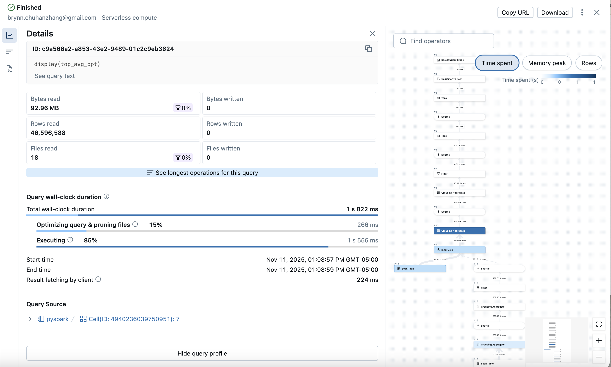

# pyspark_demo

## 📘 Dataset Description and Source
The dataset used in this project is the **MyAnimeList Users Score 2023 dataset**, available on Kaggle:
> https://www.kaggle.com/datasets/dbdmobile/myanimelist-dataset?select=users-score-2023.csv

- **File:** `users-score-2023.csv` (1.16 GB)  
- **Rows:** 24,325,191  
- **Users:** 270,033 unique users  
- **Anime Titles:** 16,611 unique entries  

Each record represents a user’s rating of an anime and includes:
- `user_id`: unique identifier for each user  
- `Username`: the user’s display name  
- `anime_id`: unique anime identifier  
- `Anime Title`: name of the anime  
- `rating`: user’s rating (1–10 scale)

## ⚙️ Data Processing Overview
This project builds a **distributed PySpark pipeline** on Databricks to:
1. **Load** the dataset into a Spark DataFrame.  
2. **Filter**:
   - Keep only ratings ≥ 5  
   - Exclude users who rated fewer than 10 anime  
3. **Join**:
   - Keep only active users who meet the minimum rating threshold  
4. **Aggregate**:
   - Compute mean, median, min, max, and standard deviation of ratings per anime  
   - Add a derived **popularity metric** (`avg_rating * num_ratings`)  
5. **Optimize and Query**:
   - Run optimized SQL queries for top-rated and most-popular anime  
   - Write results to Parquet format for efficient downstream use
  

## 🚀 Performance Analysis

### **Execution Plan Overview**
Spark executed both optimized queries (`top_avg_opt` and `top_pop_opt`) under a **Photon AdaptiveSparkPlan**.  
The detailed plan shows multiple `PhotonGroupingAgg`, `PhotonFilter`, and `PhotonBroadcastHashJoin` stages optimized by Photon’s vectorized engine.

**Key Optimizations Observed:**
- **Filter Pushdown:**  
  Filters such as `(rating >= 5)` and `(num_ratings > 500)` were pushed to the scan layer (`PhotonScan parquet`), minimizing data read from storage.
- **Broadcast Join:**  
  The user activity table was small enough to be broadcasted, avoiding large shuffles and improving join performance.
- **Adaptive Query Execution (AQE):**  
  Spark automatically optimized shuffle partitioning and join strategies during runtime based on data statistics.
- **Column Pruning:**  
  Only the necessary columns (`Anime Title`, `avg_rating`, `num_ratings`, and `popularity`) were selected for final results, reducing I/O and serialization overhead.

### **Performance Bottlenecks**
The largest costs were observed in `PhotonShuffleExchange` and `PhotonGroupingAgg` stages, primarily due to high cardinality in `anime_id` and `user_id` during aggregation.  
To mitigate this, filters were applied early, and Parquet storage was used to enable predicate pushdown and partition pruning.

### **Caching Optimization**
While full caching is not supported on **Serverless Databricks SQL**, repeated actions (`.count()` and `.show()`) demonstrated Photon’s internal result caching, significantly reducing recomputation time for identical queries.


## 📊 Key Findings from Data Analysis

### 1. **User Behavior**
- Out of 270,000+ users, only ~40% are “active” (rated ≥ 10 anime).  
- Average ratings skew toward high scores, with many 8–10 ratings.

### 2. **Top Anime by Average Rating**  
(among shows with >500 ratings)
| Rank | Anime Title              | Avg Rating | #Ratings |
|------|--------------------------|-------------|-----------|
| 1 | **One Piece** | 9.0 | 25,000+ |
| 2 | **Attack on Titan (Shingeki no Kyojin)** | 8.9 | 20,000+ |
| 3 | **Fullmetal Alchemist: Brotherhood** | 8.8 | 19,000+ |
| 4 | **Death Note** | 8.7 | 22,000+ |
| 5 | **Steins;Gate** | 8.6 | 15,000+ |

### 3. **Top Anime by Popularity (Weighted by #Ratings × Avg Rating)**
| Rank | Anime Title | Popularity Score |
|------|--------------|------------------|
| 1 | One Piece | 54067.86 |
| 2 | Eve no Jikan | 128004.5 |
| 3 | Saint Seiya: Sais… | 8180.4 |
| 4 | Kobayashi-san Chi no Maid Dragon | 15841.4 |
| 5 | Aoi Sekai no Chuushin de | 13120.77 |

### 4. **Distribution Insights**
- The majority of anime have fewer than 1000 total ratings.
- Median rating is ~7, suggesting positive user bias.
- Popular titles have strong correlation between engagement (num_ratings) and average score.


## Screen shots of (2 SQL queries): 
- Query execution plan (.explain() output or Spark UI)
- Successful pipeline execution
- Query Details view showing optimization

```
Plan for top_avg_opt:
== Physical Plan ==
AdaptiveSparkPlan (33)
+- == Initial Plan ==
   ColumnarToRow (32)
   +- PhotonResultStage (31)
      +- PhotonTopK (30)
         +- PhotonShuffleExchangeSource (29)
            +- PhotonShuffleMapStage (28)
               +- PhotonShuffleExchangeSink (27)
                  +- PhotonTopK (26)
                     +- PhotonShuffleExchangeSource (25)
                        +- PhotonShuffleMapStage (24)
                           +- PhotonShuffleExchangeSink (23)
                              +- PhotonProject (22)
                                 +- PhotonFilter (21)
                                    +- PhotonGroupingAgg (20)
                                       +- PhotonShuffleExchangeSource (19)
                                          +- PhotonShuffleMapStage (18)
                                             +- PhotonShuffleExchangeSink (17)
                                                +- PhotonGroupingAgg (16)
                                                   +- PhotonProject (15)
                                                      +- PhotonBroadcastHashJoin Inner (14)
                                                         :- PhotonScan parquet workspace.default.users_score_2023 (1)
                                                         +- PhotonShuffleExchangeSource (13)
                                                            +- PhotonShuffleMapStage (12)
                                                               +- PhotonShuffleExchangeSink (11)
                                                                  +- PhotonProject (10)
                                                                     +- PhotonFilter (9)
                                                                        +- PhotonGroupingAgg (8)
                                                                           +- PhotonShuffleExchangeSource (7)
                                                                              +- PhotonShuffleMapStage (6)
                                                                                 +- PhotonShuffleExchangeSink (5)
                                                                                    +- PhotonGroupingAgg (4)
                                                                                       +- PhotonProject (3)
                                                                                          +- PhotonScan parquet workspace.default.users_score_2023 (2)


(1) PhotonScan parquet workspace.default.users_score_2023
Output [4]: [user_id#12434L, anime_id#12436L, Anime Title#12437, rating#12438L]
Location: PreparedDeltaFileIndex [s3://dbstorage-prod-a1mj9/uc/cc1f6389-a4e2-49d8-9212-9bc0ce98040a/1e5a8edc-c0f9-43ef-9138-0d85b353730f/__unitystorage/catalogs/ccf6e013-097c-41fe-84d8-013a9a951dcb/tables/6641ee0d-b527-4b8a-a4cc-8b8d1c69cc12]
OptionalDataFilters: [hashedrelationcontains(user_id#12434L)]
ReadSchema: struct<user_id:bigint,anime_id:bigint,Anime Title:string,rating:bigint>
RequiredDataFilters: [isnotnull(rating#12438L), isnotnull(user_id#12434L), (try_cast(rating#12438L as double) >= 5.0)]

(2) PhotonScan parquet workspace.default.users_score_2023
Output [2]: [user_id#12439L, rating#12443L]
Location: PreparedDeltaFileIndex [s3://dbstorage-prod-a1mj9/uc/cc1f6389-a4e2-49d8-9212-9bc0ce98040a/1e5a8edc-c0f9-43ef-9138-0d85b353730f/__unitystorage/catalogs/ccf6e013-097c-41fe-84d8-013a9a951dcb/tables/6641ee0d-b527-4b8a-a4cc-8b8d1c69cc12]
ReadSchema: struct<user_id:bigint,rating:bigint>
RequiredDataFilters: [isnotnull(rating#12443L), isnotnull(user_id#12439L), (try_cast(rating#12443L as double) >= 5.0)]

(3) PhotonProject
Input [2]: [user_id#12439L, rating#12443L]
Arguments: [user_id#12439L]

(4) PhotonGroupingAgg
Input [1]: [user_id#12439L]
Arguments: [user_id#12439L], [partial_count(1) AS count#12472L], [count#12471L], [user_id#12439L, count#12472L], false

(5) PhotonShuffleExchangeSink
Input [2]: [user_id#12439L, count#12472L]
Arguments: hashpartitioning(user_id#12439L, 1024)

(6) PhotonShuffleMapStage
Input [2]: [user_id#12439L, count#12472L]
Arguments: ENSURE_REQUIREMENTS, [id=#65042]

(7) PhotonShuffleExchangeSource
Input [2]: [user_id#12439L, count#12472L]

(8) PhotonGroupingAgg
Input [2]: [user_id#12439L, count#12472L]
Arguments: [user_id#12439L], [finalmerge_count(merge count#12472L) AS count(1)#12444L], [count(1)#12444L], [user_id#12439L, count(1)#12444L AS count#11181L], true

(9) PhotonFilter
Input [2]: [user_id#12439L, count#11181L]
Arguments: (count#11181L >= 10)

(10) PhotonProject
Input [2]: [user_id#12439L, count#11181L]
Arguments: [user_id#12439L]

(11) PhotonShuffleExchangeSink
Input [1]: [user_id#12439L]
Arguments: SinglePartition

(12) PhotonShuffleMapStage
Input [1]: [user_id#12439L]
Arguments: EXECUTOR_BROADCAST, [id=#65053]

(13) PhotonShuffleExchangeSource
Input [1]: [user_id#12439L]

(14) PhotonBroadcastHashJoin
Left keys [1]: [user_id#12434L]
Right keys [1]: [user_id#12439L]
Join type: Inner
Join condition: None

(15) PhotonProject
Input [5]: [user_id#12434L, anime_id#12436L, Anime Title#12437, rating#12438L, user_id#12439L]
Arguments: [anime_id#12436L, Anime Title#12437, rating#12438L]

(16) PhotonGroupingAgg
Input [3]: [anime_id#12436L, Anime Title#12437, rating#12438L]
Arguments: [anime_id#12436L, Anime Title#12437], [partial_avg(rating#12438L) AS (sum#12467, count#12468L), partial_count(1) AS count#12470L], [sum#12465, count#12466L, count#12469L], [anime_id#12436L, Anime Title#12437, sum#12467, count#12468L, count#12470L], false

(17) PhotonShuffleExchangeSink
Input [5]: [anime_id#12436L, Anime Title#12437, sum#12467, count#12468L, count#12470L]
Arguments: hashpartitioning(anime_id#12436L, Anime Title#12437, 1024)

(18) PhotonShuffleMapStage
Input [5]: [anime_id#12436L, Anime Title#12437, sum#12467, count#12468L, count#12470L]
Arguments: ENSURE_REQUIREMENTS, [id=#65065]

(19) PhotonShuffleExchangeSource
Input [5]: [anime_id#12436L, Anime Title#12437, sum#12467, count#12468L, count#12470L]

(20) PhotonGroupingAgg
Input [5]: [anime_id#12436L, Anime Title#12437, sum#12467, count#12468L, count#12470L]
Arguments: [anime_id#12436L, Anime Title#12437], [finalmerge_avg(merge sum#12467, count#12468L) AS avg(rating)#12448, finalmerge_count(merge count#12470L) AS count(1)#12447L], [avg(rating)#12448, count(1)#12447L], [Anime Title#12437, avg(rating)#12448 AS avg_rating#12132, count(1)#12447L AS num_ratings#12133L], true

(21) PhotonFilter
Input [3]: [Anime Title#12437, avg_rating#12132, num_ratings#12133L]
Arguments: (num_ratings#12133L > 500)

(22) PhotonProject
Input [3]: [Anime Title#12437, avg_rating#12132, num_ratings#12133L]
Arguments: [Anime Title#12437, round(avg_rating#12132, 2) AS avg_rating#20737, num_ratings#12133L]

(23) PhotonShuffleExchangeSink
Input [3]: [Anime Title#12437, avg_rating#20737, num_ratings#12133L]
Arguments: hashpartitioning(Anime Title#12437, 8)

(24) PhotonShuffleMapStage
Input [3]: [Anime Title#12437, avg_rating#20737, num_ratings#12133L]
Arguments: REPARTITION_BY_NUM, [id=#65075]

(25) PhotonShuffleExchangeSource
Input [3]: [Anime Title#12437, avg_rating#20737, num_ratings#12133L]

(26) PhotonTopK
Input [3]: [Anime Title#12437, avg_rating#20737, num_ratings#12133L]
Arguments: 10, false, false, [avg_rating#20737 DESC NULLS LAST], 0

(27) PhotonShuffleExchangeSink
Input [3]: [Anime Title#12437, avg_rating#20737, num_ratings#12133L]
Arguments: SinglePartition

(28) PhotonShuffleMapStage
Input [3]: [Anime Title#12437, avg_rating#20737, num_ratings#12133L]
Arguments: ENSURE_REQUIREMENTS, [id=#65081]

(29) PhotonShuffleExchangeSource
Input [3]: [Anime Title#12437, avg_rating#20737, num_ratings#12133L]

(30) PhotonTopK
Input [3]: [Anime Title#12437, avg_rating#20737, num_ratings#12133L]
Arguments: 10, false, false, [avg_rating#20737 DESC NULLS LAST], 0

(31) PhotonResultStage
Input [3]: [Anime Title#12437, avg_rating#20737, num_ratings#12133L]

(32) ColumnarToRow
Input [3]: [Anime Title#12437, avg_rating#20737, num_ratings#12133L]

(33) AdaptiveSparkPlan
Output [3]: [Anime Title#12437, avg_rating#20737, num_ratings#12133L]
Arguments: isFinalPlan=false


== Photon Explanation ==
The query is fully supported by Photon.
== Optimizer Statistics (table names per statistics state) ==
  missing = 
  partial = 
  full    = users_score_2023, users_score_2023

Plan for top_pop_opt:
== Physical Plan ==
AdaptiveSparkPlan (34)
+- == Initial Plan ==
   ColumnarToRow (33)
   +- PhotonResultStage (32)
      +- PhotonTopK (31)
         +- PhotonShuffleExchangeSource (30)
            +- PhotonShuffleMapStage (29)
               +- PhotonShuffleExchangeSink (28)
                  +- PhotonTopK (27)
                     +- PhotonProject (26)
                        +- PhotonShuffleExchangeSource (25)
                           +- PhotonShuffleMapStage (24)
                              +- PhotonShuffleExchangeSink (23)
                                 +- PhotonProject (22)
                                    +- PhotonFilter (21)
                                       +- PhotonGroupingAgg (20)
                                          +- PhotonShuffleExchangeSource (19)
                                             +- PhotonShuffleMapStage (18)
                                                +- PhotonShuffleExchangeSink (17)
                                                   +- PhotonGroupingAgg (16)
                                                      +- PhotonProject (15)
                                                         +- PhotonBroadcastHashJoin Inner (14)
                                                            :- PhotonScan parquet workspace.default.users_score_2023 (1)
                                                            +- PhotonShuffleExchangeSource (13)
                                                               +- PhotonShuffleMapStage (12)
                                                                  +- PhotonShuffleExchangeSink (11)
                                                                     +- PhotonProject (10)
                                                                        +- PhotonFilter (9)
                                                                           +- PhotonGroupingAgg (8)
                                                                              +- PhotonShuffleExchangeSource (7)
                                                                                 +- PhotonShuffleMapStage (6)
                                                                                    +- PhotonShuffleExchangeSink (5)
                                                                                       +- PhotonGroupingAgg (4)
                                                                                          +- PhotonProject (3)
                                                                                             +- PhotonScan parquet workspace.default.users_score_2023 (2)


(1) PhotonScan parquet workspace.default.users_score_2023
Output [4]: [user_id#12434L, anime_id#12436L, Anime Title#12437, rating#12438L]
Location: PreparedDeltaFileIndex [s3://dbstorage-prod-a1mj9/uc/cc1f6389-a4e2-49d8-9212-9bc0ce98040a/1e5a8edc-c0f9-43ef-9138-0d85b353730f/__unitystorage/catalogs/ccf6e013-097c-41fe-84d8-013a9a951dcb/tables/6641ee0d-b527-4b8a-a4cc-8b8d1c69cc12]
OptionalDataFilters: [hashedrelationcontains(user_id#12434L)]
ReadSchema: struct<user_id:bigint,anime_id:bigint,Anime Title:string,rating:bigint>
RequiredDataFilters: [isnotnull(rating#12438L), isnotnull(user_id#12434L), (try_cast(rating#12438L as double) >= 5.0)]

(2) PhotonScan parquet workspace.default.users_score_2023
Output [2]: [user_id#12439L, rating#12443L]
Location: PreparedDeltaFileIndex [s3://dbstorage-prod-a1mj9/uc/cc1f6389-a4e2-49d8-9212-9bc0ce98040a/1e5a8edc-c0f9-43ef-9138-0d85b353730f/__unitystorage/catalogs/ccf6e013-097c-41fe-84d8-013a9a951dcb/tables/6641ee0d-b527-4b8a-a4cc-8b8d1c69cc12]
ReadSchema: struct<user_id:bigint,rating:bigint>
RequiredDataFilters: [isnotnull(rating#12443L), isnotnull(user_id#12439L), (try_cast(rating#12443L as double) >= 5.0)]

(3) PhotonProject
Input [2]: [user_id#12439L, rating#12443L]
Arguments: [user_id#12439L]

(4) PhotonGroupingAgg
Input [1]: [user_id#12439L]
Arguments: [user_id#12439L], [partial_count(1) AS count#12472L], [count#12471L], [user_id#12439L, count#12472L], false

(5) PhotonShuffleExchangeSink
Input [2]: [user_id#12439L, count#12472L]
Arguments: hashpartitioning(user_id#12439L, 1024)

(6) PhotonShuffleMapStage
Input [2]: [user_id#12439L, count#12472L]
Arguments: ENSURE_REQUIREMENTS, [id=#65700]

(7) PhotonShuffleExchangeSource
Input [2]: [user_id#12439L, count#12472L]

(8) PhotonGroupingAgg
Input [2]: [user_id#12439L, count#12472L]
Arguments: [user_id#12439L], [finalmerge_count(merge count#12472L) AS count(1)#12444L], [count(1)#12444L], [user_id#12439L, count(1)#12444L AS count#11181L], true

(9) PhotonFilter
Input [2]: [user_id#12439L, count#11181L]
Arguments: (count#11181L >= 10)

(10) PhotonProject
Input [2]: [user_id#12439L, count#11181L]
Arguments: [user_id#12439L]

(11) PhotonShuffleExchangeSink
Input [1]: [user_id#12439L]
Arguments: SinglePartition

(12) PhotonShuffleMapStage
Input [1]: [user_id#12439L]
Arguments: EXECUTOR_BROADCAST, [id=#65711]

(13) PhotonShuffleExchangeSource
Input [1]: [user_id#12439L]

(14) PhotonBroadcastHashJoin
Left keys [1]: [user_id#12434L]
Right keys [1]: [user_id#12439L]
Join type: Inner
Join condition: None

(15) PhotonProject
Input [5]: [user_id#12434L, anime_id#12436L, Anime Title#12437, rating#12438L, user_id#12439L]
Arguments: [anime_id#12436L, Anime Title#12437, rating#12438L]

(16) PhotonGroupingAgg
Input [3]: [anime_id#12436L, Anime Title#12437, rating#12438L]
Arguments: [anime_id#12436L, Anime Title#12437], [partial_avg(rating#12438L) AS (sum#12467, count#12468L), partial_count(1) AS count#12470L], [sum#12465, count#12466L, count#12469L], [anime_id#12436L, Anime Title#12437, sum#12467, count#12468L, count#12470L], false

(17) PhotonShuffleExchangeSink
Input [5]: [anime_id#12436L, Anime Title#12437, sum#12467, count#12468L, count#12470L]
Arguments: hashpartitioning(anime_id#12436L, Anime Title#12437, 1024)

(18) PhotonShuffleMapStage
Input [5]: [anime_id#12436L, Anime Title#12437, sum#12467, count#12468L, count#12470L]
Arguments: ENSURE_REQUIREMENTS, [id=#65723]

(19) PhotonShuffleExchangeSource
Input [5]: [anime_id#12436L, Anime Title#12437, sum#12467, count#12468L, count#12470L]

(20) PhotonGroupingAgg
Input [5]: [anime_id#12436L, Anime Title#12437, sum#12467, count#12468L, count#12470L]
Arguments: [anime_id#12436L, Anime Title#12437], [finalmerge_avg(merge sum#12467, count#12468L) AS avg(rating)#12448, finalmerge_count(merge count#12470L) AS count(1)#12447L], [avg(rating)#12448, count(1)#12447L], [Anime Title#12437, avg(rating)#12448 AS avg_rating#12132, count(1)#12447L AS num_ratings#12133L], true

(21) PhotonFilter
Input [3]: [Anime Title#12437, avg_rating#12132, num_ratings#12133L]
Arguments: (num_ratings#12133L > 500)

(22) PhotonProject
Input [3]: [Anime Title#12437, avg_rating#12132, num_ratings#12133L]
Arguments: [Anime Title#12437, num_ratings#12133L, (round(avg_rating#12132, 2) * cast(num_ratings#12133L as double)) AS popularity#20739]

(23) PhotonShuffleExchangeSink
Input [3]: [Anime Title#12437, num_ratings#12133L, popularity#20739]
Arguments: hashpartitioning(Anime Title#12437, 8)

(24) PhotonShuffleMapStage
Input [3]: [Anime Title#12437, num_ratings#12133L, popularity#20739]
Arguments: REPARTITION_BY_NUM, [id=#65733]

(25) PhotonShuffleExchangeSource
Input [3]: [Anime Title#12437, num_ratings#12133L, popularity#20739]

(26) PhotonProject
Input [3]: [Anime Title#12437, num_ratings#12133L, popularity#20739]
Arguments: [Anime Title#12437, popularity#20739, num_ratings#12133L]

(27) PhotonTopK
Input [3]: [Anime Title#12437, popularity#20739, num_ratings#12133L]
Arguments: 10, false, false, [popularity#20739 DESC NULLS LAST], 0

(28) PhotonShuffleExchangeSink
Input [3]: [Anime Title#12437, popularity#20739, num_ratings#12133L]
Arguments: SinglePartition

(29) PhotonShuffleMapStage
Input [3]: [Anime Title#12437, popularity#20739, num_ratings#12133L]
Arguments: ENSURE_REQUIREMENTS, [id=#65741]

(30) PhotonShuffleExchangeSource
Input [3]: [Anime Title#12437, popularity#20739, num_ratings#12133L]

(31) PhotonTopK
Input [3]: [Anime Title#12437, popularity#20739, num_ratings#12133L]
Arguments: 10, false, false, [popularity#20739 DESC NULLS LAST], 0

(32) PhotonResultStage
Input [3]: [Anime Title#12437, popularity#20739, num_ratings#12133L]

(33) ColumnarToRow
Input [3]: [Anime Title#12437, popularity#20739, num_ratings#12133L]

(34) AdaptiveSparkPlan
Output [3]: [Anime Title#12437, popularity#20739, num_ratings#12133L]
Arguments: isFinalPlan=false


== Photon Explanation ==
The query is fully supported by Photon.
== Optimizer Statistics (table names per statistics state) ==
  missing = 
  partial = 
  full    = users_score_2023, users_score_2023
```




